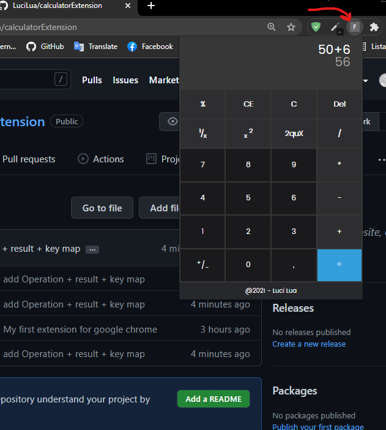

# Preview

Hi everyone, this is my first Google Chrome extension.

a handy calculator for your browser.

(*under development*)

### **Operations:**

- Addition
- Subtraction
- Division
- Multiplication
- Square root
- Potentiation
- Percentage
- 1/x (?)

### **Tools:**

**Del:** Delete by number

**C:** Erase all numbers

**CE**: Delete only the main value

